# WorkBuddy 连接本地 MCP Server 教程

本文档用于指导用户在自己的电脑上安装并启动本项目，然后将本地 MCP Server 接入 WorkBuddy。

## 一、前置条件

使用前请先确认电脑已经安装：

- Node.js
- npm
- WorkBuddy

可以在终端中执行下面的命令检查 Node.js 和 npm 是否可用：

```bash
node -v
npm -v
```

如果能够正常输出版本号，说明环境已经准备好。

## 二、解压项目

将项目解压到本地电脑的某个目录中，例如：

```text
D:\测试
```

解压后可以看到项目目录结构：

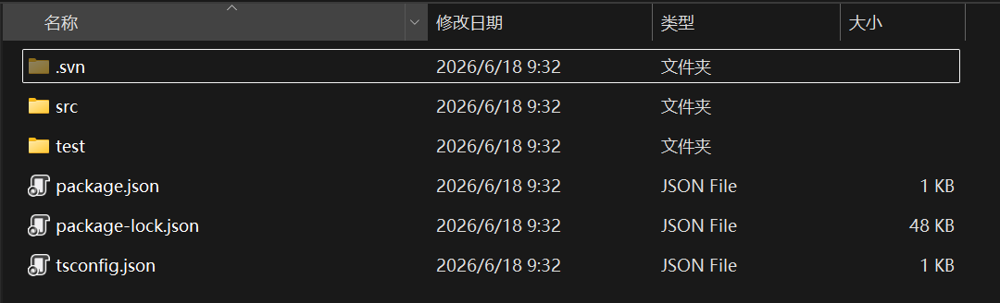

进入项目后，可以看到 `src`、`package.json` 等文件。

其中：

- `src/index.ts` 是 MCP Server 的源码入口。
- `dist/src/index.js` 是编译后 WorkBuddy 实际启动的文件。
- `package.json` 所在目录就是项目根目录。

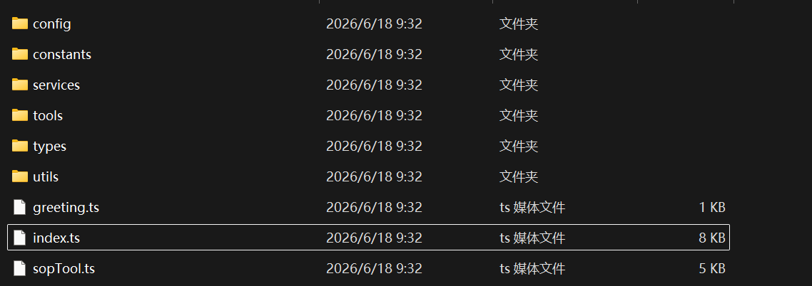

## 三、安装依赖

打开终端，进入项目根目录。

例如项目解压在 `D:\测试`，则执行：

```bash
cd D:\测试
```

然后安装项目依赖：

```bash
npm install
```

等待依赖安装完成。

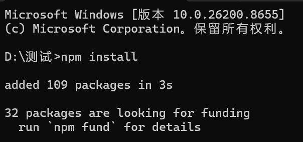

## 四、编译项目

依赖安装完成后，执行：

```bash
npm run build
```

该命令会把 `src` 目录中的 TypeScript 代码编译到 `dist` 目录中。

编译完成后，请确认存在下面这个文件：

```text
dist\src\index.js
```

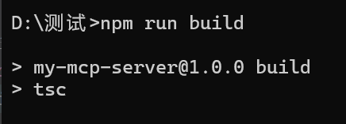

## 五、准备 WorkBuddy MCP 配置

WorkBuddy 需要通过 JSON 配置启动这个 MCP Server。

配置模板如下：

```json
{
  "mcpServers": {
    "my-mcp-server": {
      "type": "stdio",
      "command": "node",
      "args": [
        "项目所在目录\\dist\\src\\index.js"
      ],
      "cwd": "项目所在目录"
    }
  }
}
```

需要替换两个地方：

- `args`：填写编译后的 `index.js` 文件路径。
- `cwd`：填写项目根目录，也就是 `package.json` 所在目录。

如果项目放在：

```text
D:\测试
```

那么配置应该写成：

```json
{
  "mcpServers": {
    "my-mcp-server": {
      "type": "stdio",
      "command": "node",
      "args": [
        "D:\\测试\\dist\\src\\index.js"
      ],
      "cwd": "D:\\测试"
    }
  }
}
```

注意：JSON 中 Windows 路径的 `\` 需要写成 `\\`。

## 六、在 WorkBuddy 中添加连接器

打开 WorkBuddy，点击 **连接器**。

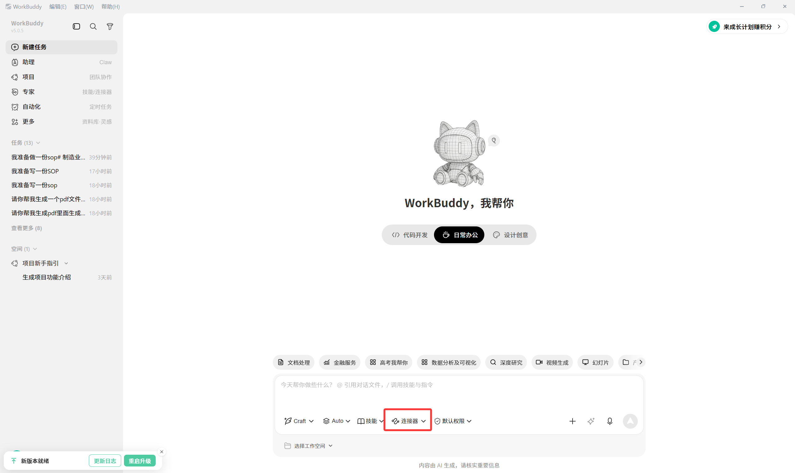

点击 **管理连接器**。

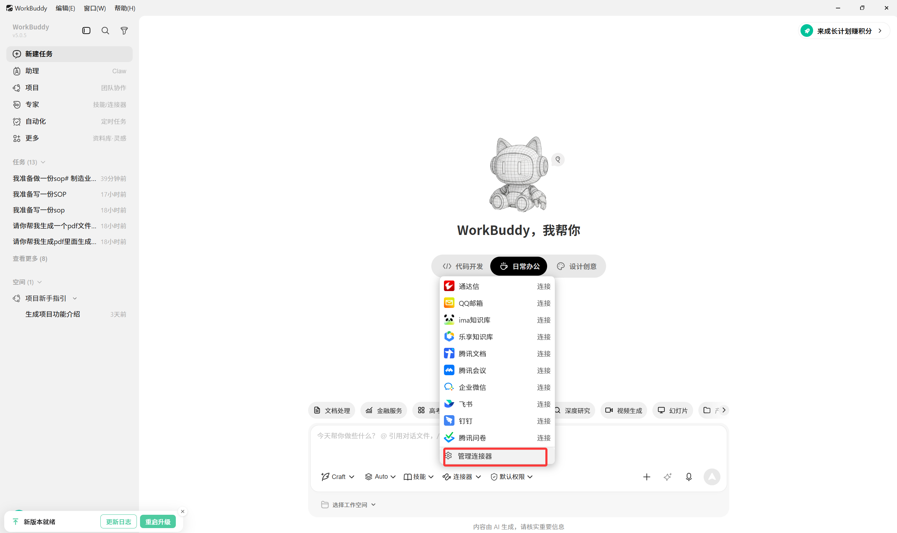

点击 **自定义连接器**。

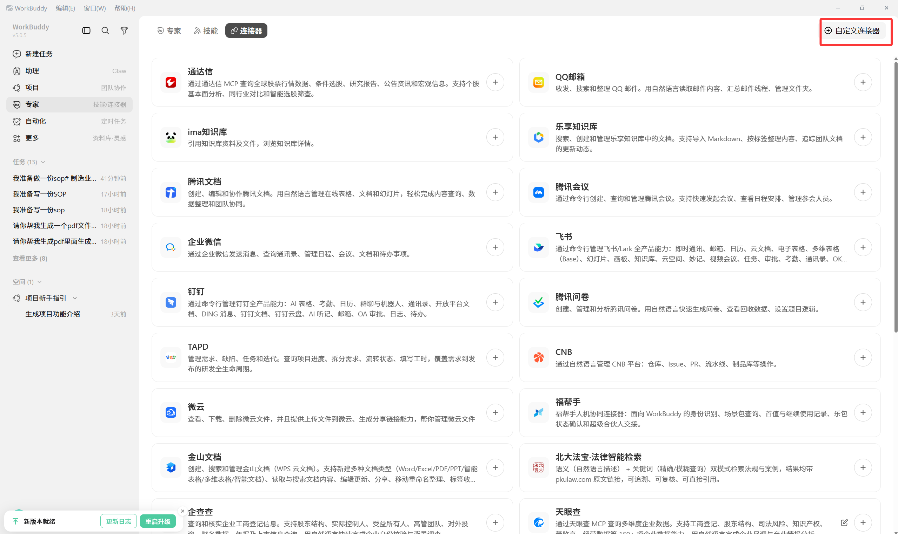

点击 **配置**。

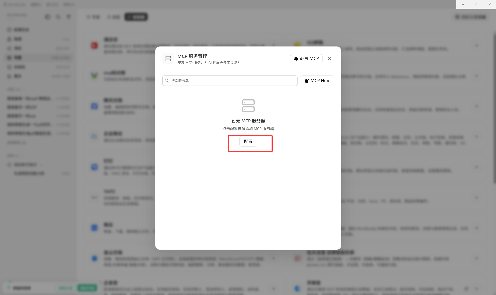

将前面准备好的 MCP 配置 JSON 填入输入框。

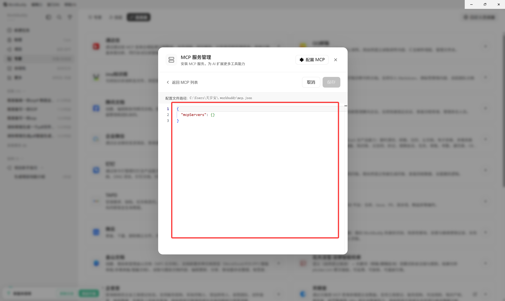

点击 **保存**。

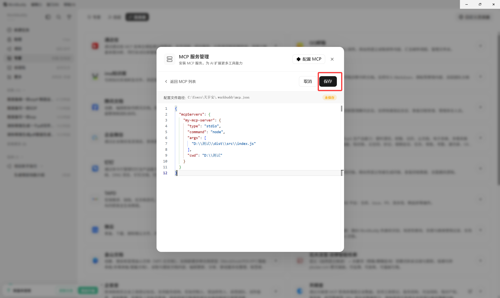

保存后返回 MCP 列表，点击 **信任**。

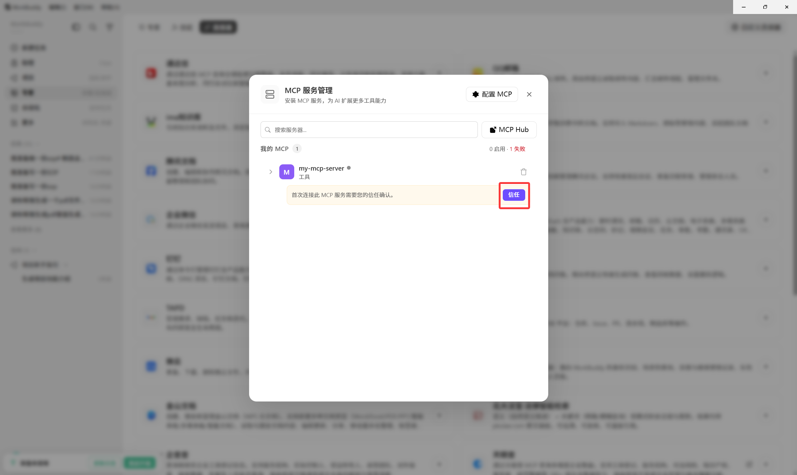

当连接器旁边出现绿色圆点时，表示 MCP Server 已经连接成功。

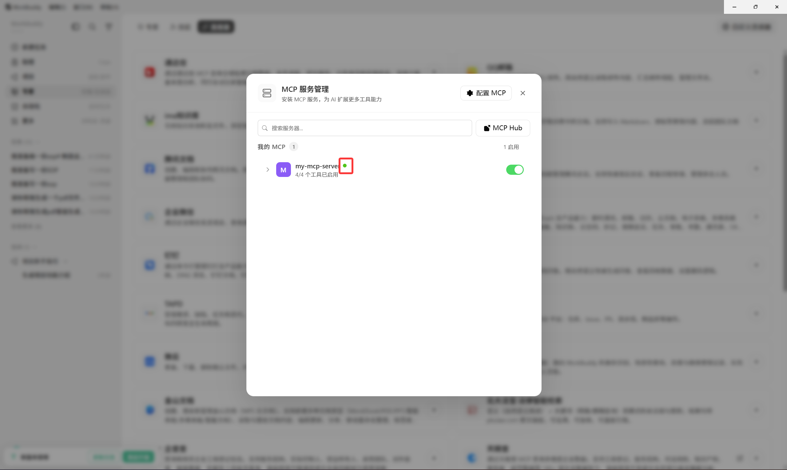

## 七、测试 MCP Server

新建一个对话，直接询问和 MCP 相关的问题，例如：

```text
帮我查询 SOP 分类列表
```

或者：

```text
帮我查询异常报表
```

如果 WorkBuddy 能够调用工具并返回结果，说明连接成功。

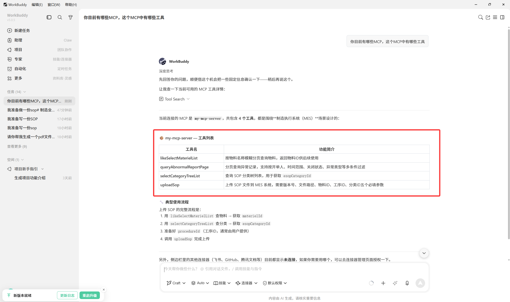

## 八、常见问题

### 1. WorkBuddy 找不到 MCP Server

优先检查：

- `node -v` 是否能正常输出。
- `npm install` 是否执行成功。
- `npm run build` 是否执行成功。
- `dist\src\index.js` 是否存在。
- WorkBuddy 配置中的路径是否写对。
- JSON 路径中的 `\` 是否写成了 `\\`。

### 2. 配置后没有绿色圆点

可以先在项目根目录手动执行：

```bash
node dist\src\index.js
```

如果没有立即报错，说明 MCP Server 基本可以启动。

因为本项目是 `stdio` 类型 MCP Server，手动启动后终端可能看起来没有反应，这是正常现象，它正在等待 WorkBuddy 连接。

测试完成后可以按 `Ctrl + C` 退出。

### 3. 换一台电脑后配置不能直接用

这是正常的。

因为 MCP 配置中的路径是本机路径。换电脑后，需要把：

```json
"args": [
  "项目所在目录\\dist\\src\\index.js"
],
"cwd": "项目所在目录"
```

改成新电脑上的真实项目路径。
